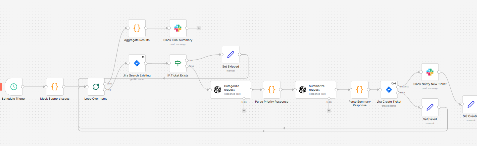

# Support Issue Automation - n8n Workflow

Automated support issue triage workflow that uses AI to classify priority and generate summaries, then syncs to Jira with Slack notifications.

## Assignment Requirements Coverage

| Requirement | Implementation |
|-------------|----------------|
| 5+ distinct steps | 16 nodes total |
| 2+ tools | Jira, Slack, OpenAI |
| Clear done output | Final Slack summary with statistics |
| Defined state | Tracked via workflow data (`status`, `ai_priority`, `ai_summary`) |
| Branching decision | IF node: ticket exists check |
| Loop | Loop Over Items (SplitInBatches) iterates through issues |
| Classification | AI classifies priority using semantic analysis |

## Workflow Flow

```
Schedule Trigger (every 24 hours)
    ↓
Mock Support Issues (3 test cases)
    ↓
Loop Over Items ←──────────────────────────────────────┐
    ├─ [done] → Aggregate Results → Slack Final Summary│
    ↓                                                  │
Jira Search Existing (check if ticket exists)          │
    ↓                                                  │
IF Ticket Exists?                                      │
  ├─ Yes → Set Skipped ────────────────────────────────┤
  └─ No ↓                                              │
Categorize request (OpenAI GPT-4o-mini)                │
    ↓                                                  │
Parse Priority Response                                │
    ↓                                                  │
Summarize request (OpenAI GPT-4o-mini)                 │
    ↓                                                  │
Parse Summary Response                                 │
    ↓                                                  │
Jira Create Ticket                                     │
  ├─ Success → Slack Notify → Set Created ─────────────┤
  └─ Error → Set Failed ───────────────────────────────┘
```



## Prerequisites

### n8n Credentials Required

1. **OpenAI API** - For AI classification and summarization (GPT-4o-mini)
2. **Jira Software Cloud** - For ticket management
3. **Slack** - For notifications

## Installation

1. Open n8n
2. Go to Workflows → Import
3. Upload `Support Issue Automation FINAL.json`
4. Verify credentials are configured:
   - OpenAI API credentials
   - Jira Software Cloud credentials
   - Slack API credentials
5. Save the workflow

## Testing

1. Open the workflow in n8n
2. Click "Execute Workflow" to run manually (instead of waiting for scheduled trigger)
3. Watch the execution progress through each node
4. Check Slack channel for notifications
5. Verify Jira tickets were created in Flight Schedule Pro project

## Mock Data

This project was a real-world request to automatically create Jira tickets based on multiple client feedback sites. A future phase could implement connectivity to those sites, but for this proof of concept, mock data was used.

## AI Priority Classification

The AI agent (GPT-4o-mini) uses semantic analysis to classify priorities.

Numeric values were needed to map to the correct priority id in Jira.

### Priority 10001 - Critical (System Down / Emergency)
- **Definition:** Complete system failure, security breaches, data loss, or issues affecting all users
- **Context Clues:** "Site is down", "data breach", "404 on homepage", "outage", "critical failure"
- **Constraint:** Do not use for individual user errors or minor bugs, even with words like "urgent"

### Priority 2 - High (Major Feature Failure)
- **Definition:** A core function is broken or a specific group of users is blocked
- **Context Clues:** "Cannot checkout", "payment failed", "login broken", "production error"

### Priority 3 - Medium (Impaired Functionality)
- **Definition:** System working with bugs, slowness, or intermittent errors; workarounds exist
- **Context Clues:** "Slow loading", "glitch", "intermittent", "error message", "timeout"

### Priority 4 - Low (General / Cosmetic)
- **Definition:** Questions, feature requests, typos, or minor UI issues
- **Context Clues:** "How do I...", "feature request", "typo", "color is wrong"

### AI Response Format
```json
{"priority": "10001|2|3|4", "reason": "Brief explanation based on impact"}
```

## AI Summarization

The summarization agent creates Jira ticket descriptions with:
1. Core problem statement (one sentence)
2. Business impact (brief)
3. Relevant technical details
4. Maximum 2-4 sentences

**Rules enforced:**
- No invented details
- No speculation about causes or solutions
- No greetings, sign-offs, or filler
- Plain text only (no markdown)

## Workflow Nodes

| # | Node Name | Type | Description |
|---|-----------|------|-------------|
| 1 | Schedule Trigger | Trigger | Runs every 24 hours |
| 2 | Mock Support Issues | Code | Generates 3 test support tickets |
| 3 | Loop Over Items | SplitInBatches | Iterates through each issue |
| 4 | Jira Search Existing | Jira | Checks if ticket already exists by ID |
| 5 | IF Ticket Exists | If | Routes based on existing ticket check |
| 6 | Set Skipped | Set | Marks existing tickets as skipped |
| 7 | Categorize request | OpenAI | AI classifies priority |
| 8 | Parse Priority Response | Code | Parses AI JSON response |
| 9 | Summarize request | OpenAI | AI generates ticket summary |
| 10 | Parse Summary Response | Code | Parses summary and prepares ticket data |
| 11 | Jira Create Ticket | Jira | Creates Story in Flight Schedule Pro |
| 12 | Slack Notify New Ticket | Slack | Sends per-ticket notification |
| 13 | Set Created | Set | Marks ticket as created with metadata |
| 14 | Set Failed | Set | Marks failed ticket creations |
| 15 | Aggregate Results | Code | Compiles statistics from all iterations |
| 16 | Slack Final Summary | Slack | Sends summary with counts and breakdown |

## Evaluation Workflow

A separate eval workflow (`Support Issue Automation Eval.json`) tests only the priority classification. The summarization and tool integrations (Jira, Slack) were removed to avoid external tool usage during evals.

### Eval Flow

```
Evaluation Trigger (Google Sheets) → Categorize request → Parse Priority Response → Set Outputs → Set Metrics
```

### Eval Nodes

| Node | Type | Purpose |
|------|------|---------|
| When fetching a dataset row | Evaluation Trigger | Reads test cases from Google Sheets |
| Categorize request | OpenAI | Same prioritization prompt as main workflow |
| Parse Priority Response | Code | Parses AI JSON response |
| Set Outputs on Google Sheet | Evaluation | Writes `actual_priority` back to sheet |
| Set Metrics | Evaluation | Computes `priority_match` metric |

### Dataset

- **Source:** Google Sheets (`support-tickets`)

### Metric

```
priority_match = (expected_priority == actual priorityLabel)
```

## Files

- `Support Issue Automation FINAL.json` - Main n8n workflow
- `Support Issue Automation Eval.json` - Eval workflow (priority classification only)
- `README.md` - This file
